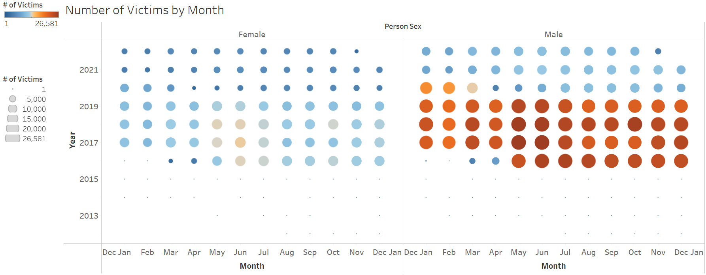

# NYC Motor Vehicle Collision Transparency
- Author(s): Jason Jiang, Gabriel Fernandez
- Date Created: Nov. 29th 2022
- Class: CIS 9440

## Project Objective: 
Following the Kimball Lifecycle to design and develop a public, cloud-based Data Warehouse with a functioning BI Applications

## Project Tools:
The tools used to build this Data Warehouse were: (change this to make applicable to your project)
1. Data Integration: Python (Jupyter Notebooks, Google Colab)
2. Data Warehousing: Google BigQuery
3. Business Intelligence: Tableau

## Kimball Lifecycle Project Stages

### Project Planning
Motivation for project:
A recent congestion pricing plan will charge drivers $23 to enter Manhattan if implemented. It was part of NYC’s strategy to tackle congestion and other problems relating to the city’s health ([source](https://www.nytimes.com/2022/08/18/nyregion/nyc-congestion-pricing-manhattan.html)). This sparked our group’s interest in taking a look into the traffic congestion statistics in NYC - specifically relating to traffic accidents. This is especially relevant now that the city is implementing more bike lanes and reducing carbon emissions. For example, in 2013, Citi Bike was launched as an alternative transportation method to help the environment and keep the city’s citizens healthy. 

We want to see how traffic collisions in NYC changed over the years and if additions similar to Citi Bike made traffic conditions better or worse for the city. Our group hopes to bring more transparency to traffic collisions in NYC.

#### Description of the issues or opportunities the project will address:
- What are collision statistics broken down by vehicle type? (Cars, bikes, motorcycles, buses, etc.)
    - Is there seasonality to this? 
    - Driver’s license status
- What are the areas in the city most prone to collisions? (Boroughs, Zip Codes, etc.)
- What time are collisions more likely to occur? (Rush hour, mornings, etc.)
- Which are contributing factors of collisions in NYC?
    - Person emotional status
    - Pre-crash action (right turns, merges, etc.)
- What are the demographics of those involved in collisions?
    - Gender
    - Age
    - Borough 

#### Project Business or Organization Value:
##### High-level Business Initiative:
We want to discover where and when most motor vehicle accidents happen in NYC and which demographics are more affected. Our group ultimately wants to bring transparency to the traffic collisions in NYC.

&nbsp;

##### BI Sponsors and Stakeholders (who will own this project?)
This project is by Baruch students working for the NYC Department of Transportation (NYC DOT).

&nbsp;

##### What’s the Business Value?
By identifying the context of motor vehicle accidents, we can come up with suggestions to guide city leaders in preventing these types of accidents.

### Data Sources:
1. https://data.cityofnewyork.us/Public-Safety/Motor-Vehicle-Collisions-Crashes/h9gi-nx95
2. https://data.cityofnewyork.us/Public-Safety/Motor-Vehicle-Collisions-Person/f55k-p6yu

### Business Requirements Definition
List of Data Warehouse KPI's:
1. Number of Collisions by Year
2. Number of Collisions by Hour
3. Number of Victims by Month
4. Number of Victims by Age
5. Number of Collisions by Zip Code
6. Number of Cyclist Collisions by Year

### Dimensional Model
This project's Dimensional Model consists of 2 Facts and 4 Dimensions:
{: width="50%"}

&nbsp;

This project's Kimball Bus Matrix:

### Business Intelligence Design and Development
List of Visualizations for each KPI:
1. Line chart showing number of collisions by year allows us to see changes that occur over time. This allows us to investigate what year collisions are more likely to occur.

2. Bar chart showing number of collisions by hour. This KPI can show which time (24-hour clock) collisions are more likely to occur. The Metropolitan Transportation Authority can use this insight to increase public transportation during crash- prone hours to disincentivize driving.

3. Bubble Graph showing the number of victims by month (by year). The size of each bubble correlates to the number of victims for that month. This can help the audience easily digest when most collisions take place and allow experts to perhaps better plan city traffic during months of high collisions.

4. Histogram showing number of victims by age. A histogram works well here because it breaks down the frequency of collisions by age group (bins). We also further separated the data to look a male v.s female statistics of the victims. Public safety officials can create educational campaigns targeting the age and gender groups more likely to experience a collision.

5. Another line graph showing number of cyclist collisions by year. We want to see how the introduction of city bikes since 2013 affected overall cyclist collisions (injuries and death).

6. Tree map showing number of collisions by zip code. A tree map can be used here because they capture relative sizes of categories (in this case zip codes). This is especially helpful because we are mainly interested <b>mainly</b> in areas with the high collision counts. The New York City Department of Transportation can prioritize the zip codes with higher collisions with initiatives to reduce and prevent collisions.

&nbsp;

BI Application Wireframe Design:

&nbsp;

Picture of final Dashboard:
<b>Dashboard 1:</b>

 

<b>Dashboard 2:</b>

### Deployment
The project was deployed on Tableau Public:
1. [Dashboard 1](https://public.tableau.com/app/profile/jason.jiang4864/viz/NYCMotorVehicleCollisionTransparency/Dashboard?publish=yes)
2. [Dashboard 2 (continued)](https://public.tableau.com/app/profile/jason.jiang4864/viz/NYCMotorVehicleCollisionTransparencycontinued/Dashboard2?publish=yes)